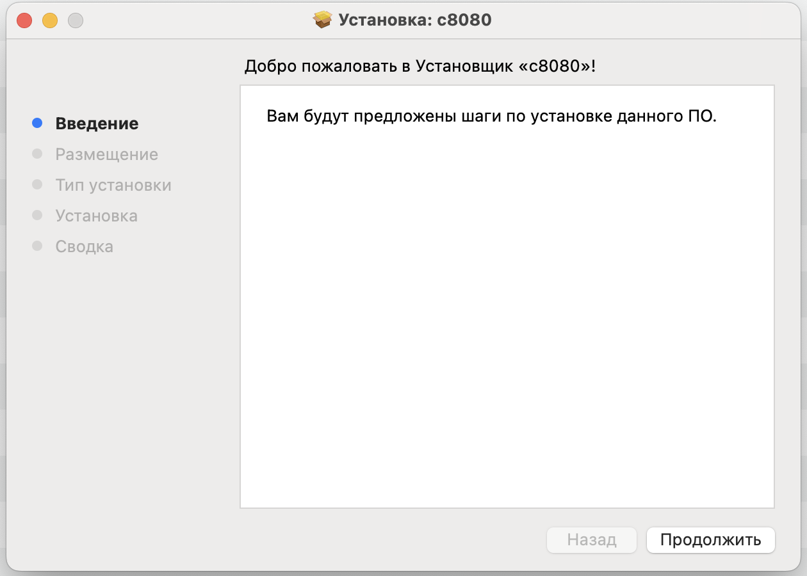
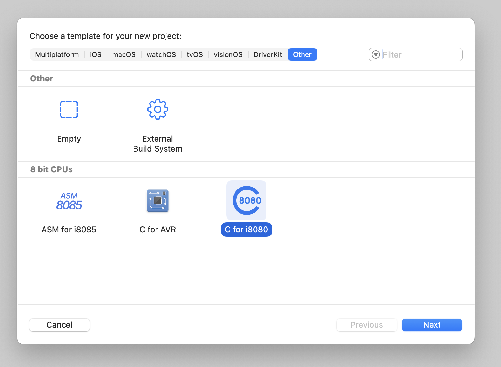
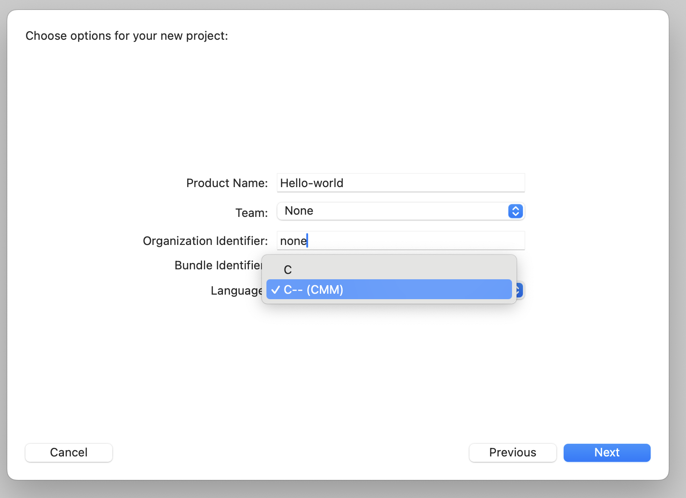

# Плагин для XCODE

> **Note**
> Большая благодарность Алексею Морозову за компилятор с8080 (https://github.com/alemorf/c8080). Без него проект бы не состоялся!

Плагин позволяет компилировать код для процессора 580ВМ80 (i8080) на языке C или C-- (CMM)

# Устанока 

Запустите файл установки [8080.pkg](https://github.com/KhimuninAA/C8080_XCODE_Template/releases#:~:text=3-,8080.pkg,-sha256%3A25f5039042e6552dca5dd6c6b2272be215892222d4be18e125339eec242c0299) 

# Создание нового проекта в XCODE

- File->New->Project (shift+command+N)

    

- Выберите язык C или C--

    

